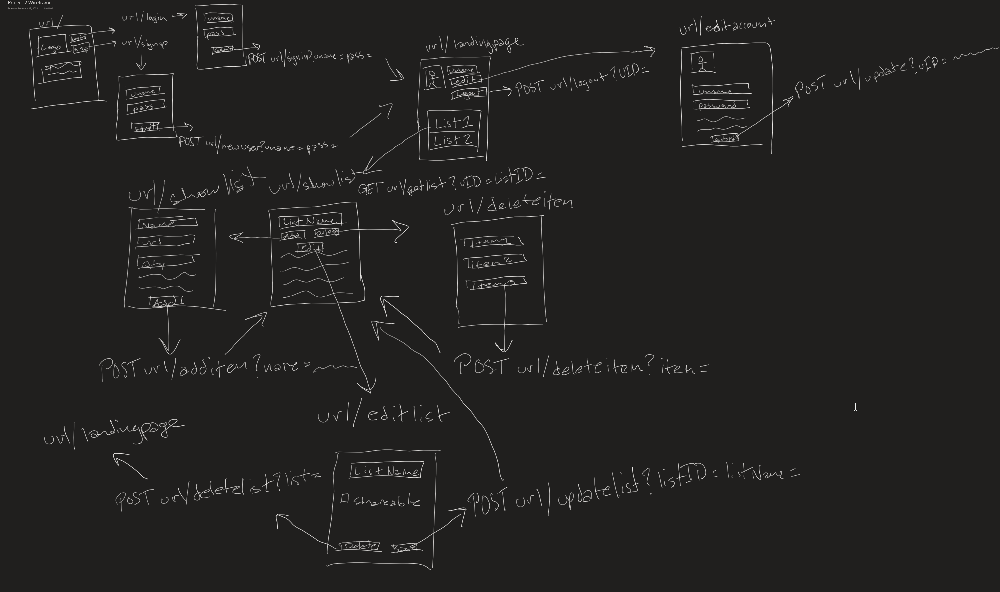
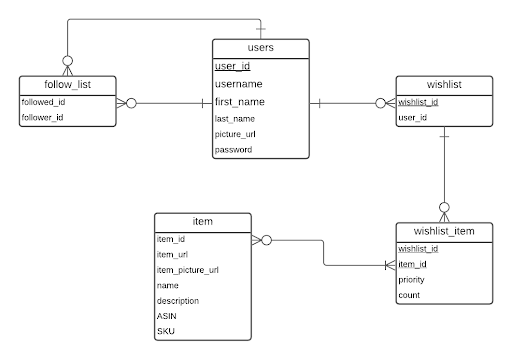

# cst438-project-2

[**WISHLIST APP**](https://infinite-ravine-21110.herokuapp.com/)

This app is being created by Olisemedua Onwuatogwu, Osman Safi, Alejandro Ramirez, and Charlie Dolton.

This project will be a wishlist created using springboot.

We will design the database as well as the API the app uses. Intended functionality includes account creation and user login; creating, deleting, and editing a list; creating, deleting, and editing items; sharing a list via a link; and following another user. 

This is our initial wireframe:

And this is our initial ERD:

